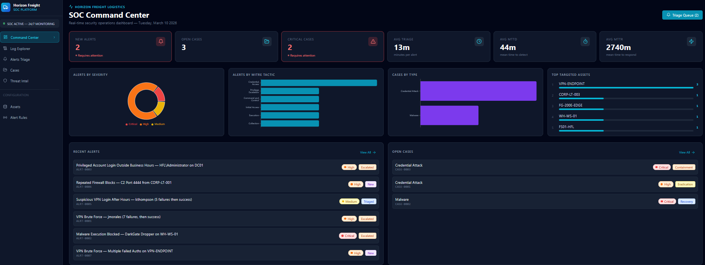
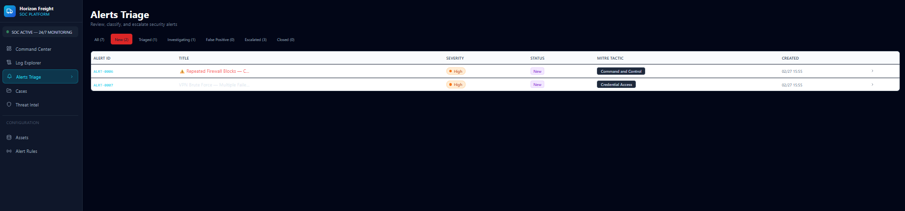
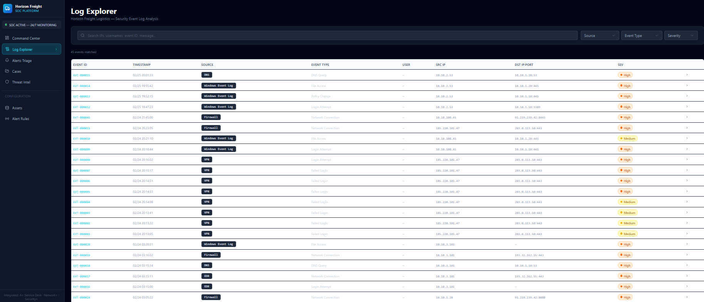

# horizon-freight-security-operations
Security Operations Center (SOC) simulation with security monitoring, threat detection, incident triage, and investigation workflows.
# Horizon Freight Security Operations (SOC) Simulation

Security Operations Center (SOC) simulation designed to demonstrate enterprise security monitoring, threat detection, and incident response workflows.

This project models how a SOC team monitors infrastructure, triages alerts, investigates threats, and manages security incidents within an enterprise environment.

---

## Architecture Summary

The SOC platform monitors security telemetry from multiple enterprise infrastructure components.

Monitored systems include:

• Domain Controller (Active Directory / Authentication Logs)  
• Corporate Workstations  
• Fortinet Edge Firewall  
• VPN Authentication Activity  
• DNS Activity  
• Network Infrastructure Devices  

Security events from these systems are analyzed through the SOC monitoring platform to detect suspicious behavior and respond to threats.
## SOC Command Center

The Horizon Freight Security Operations Center (SOC) dashboard provides real-time visibility into security alerts, ongoing investigations, and threat activity across the enterprise environment.

Security analysts use this command center to monitor alerts, triage incidents, track investigation metrics, and coordinate response efforts.

---
---
## Alert Triage

Security alerts are reviewed and classified through the SOC triage queue. Analysts evaluate alert severity, associated MITRE ATT&CK tactics, and determine whether escalation or investigation is required.

This process helps prioritize high-risk threats and ensures timely response to potential security incidents.

## Log Explorer

The SOC Log Explorer provides centralized visibility into security telemetry collected from multiple infrastructure sources including firewalls, VPN gateways, DNS servers, and Windows event logs.

Security analysts use this interface to investigate suspicious activity, correlate security events, and identify potential indicators of compromise across the environment.

## Security Monitoring Capabilities

The SOC platform supports detection and investigation of security events such as:

• Privileged account logins outside business hours  
• Repeated firewall blocks indicating scanning or exploitation attempts  
• Suspicious VPN authentication activity  
• Malware execution attempts on corporate endpoints  
• Brute force authentication attempts  
• Unauthorized access to sensitive systems  

---

## Incident Investigation Workflow

Security alerts follow a structured investigation lifecycle:

1. Alert Detection  
2. Initial Triage  
3. Threat Investigation  
4. Containment  
5. Eradication  
6. Recovery  
7. Post-Incident Documentation

---

## SOC Metrics Tracked

The platform tracks operational metrics used by security teams:

• Active security alerts  
• Open investigations  
• Critical threat cases  
• Average triage time  
• Mean Time to Detect (MTTD)  
• Mean Time to Respond (MTTR)

---

## Objective

This project demonstrates applied cybersecurity concepts aligned with:

• Security Operations (SOC)  
• Threat Detection and Monitoring  
• Incident Response  
• Log Analysis  
• Security Event Investigation
